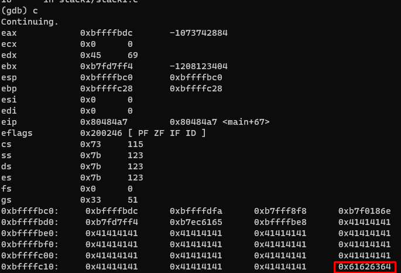

# STACK1
This stack is pretty the same as 0. We need overwrite "modified" with value `0x61626364`

So the offset from buffer was 64, so we add to program input `'A' * 64`
But we need exactly 0x61626364 in "modified", so we put `'A' * 64 + 0x64636261 (little endidan)`

